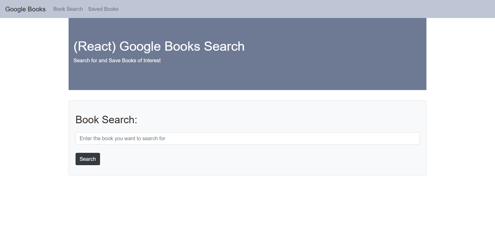
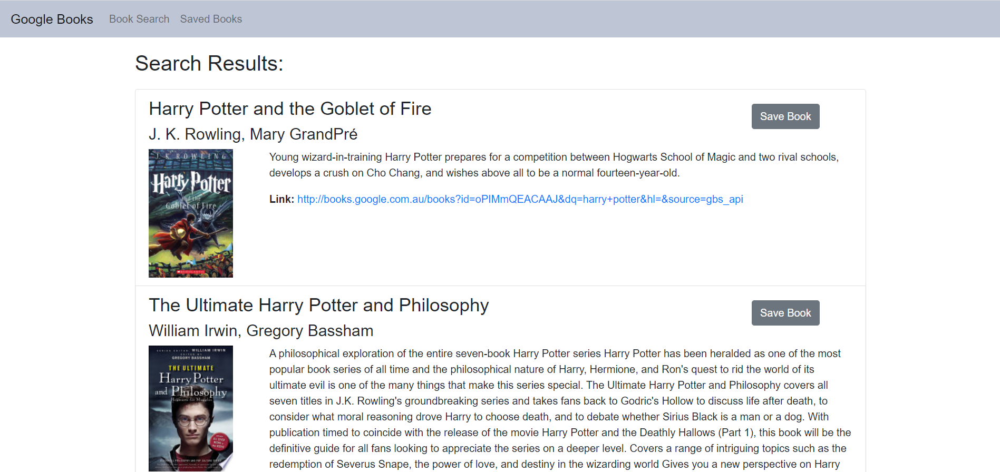
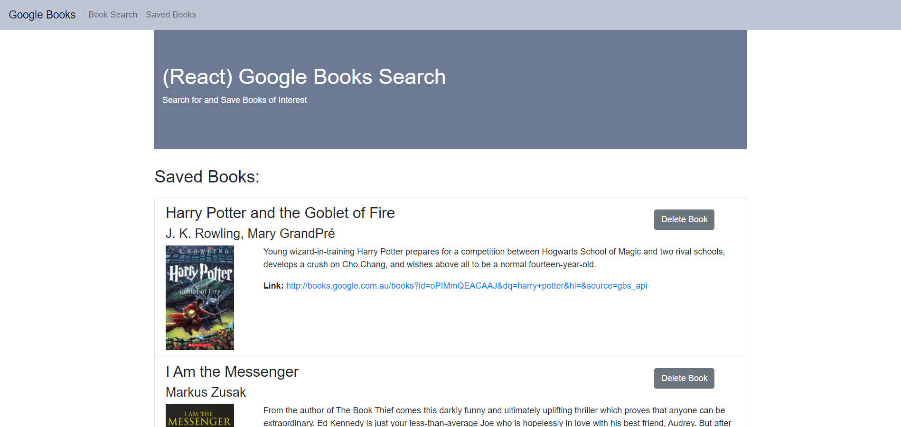

# Google Book Search

This application was created using the MERN stack (Mongo, Express, React and Node). Using the Google Books API as a third party API, it allows the user to search for books. With REST APIs the books can be saved to a list of saved books and deletede if required.
Bootstrap was used as the CSS framework. 

The application has been deployed on heroku: 

## Preview: 

